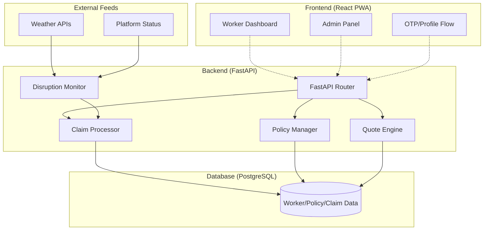

# GigShield: Empowering the Gig Economy

**Parametric Micro-Insurance for India's Gig Workforce**

[](https://fastapi.tiangolo.com/)
[](https://reactjs.org/)
[](https://www.postgresql.org/)
[](https://www.docker.com/)

---

## Overview

**GigShield** is a revolutionary parametric micro-insurance platform designed specifically for the 15 million+ gig workers in India. Unlike traditional insurance, GigShield uses real-time data triggers (weather, platform outages, traffic disruptions) to provide instant coverage and automated payouts, ensuring financial stability for those who live on daily/weekly earnings.

Built for the **Guidewire DEVTrails 2026**, GigShield addresses the volatility of gig work with a "buy-as-you-go" weekly policy model.

## Key Features

- **Parametric Payouts**: Instant claim processing triggered by external data (e.g., Rainfall > 50mm) rather than manual assessment.
- **Dynamic Pricing**: Premium quotes calculated in real-time based on city, platform, average earnings, and tenure.
- **Trust-Based Underwriting**: Incorporates a "Trust Score" to reward consistent and verified workers with lower premiums.
- **PWA Native Experience**: A mobile-first, installable Progressive Web App (PWA) for workers on the move.
- **Fraud Prevention**: Real-time logging and monitoring of suspicious activities to protect the pool.
- **Admin Review Queue**: A streamlined interface for administrators to monitor system health and handle complex claims.

---

## System Architecture



---

## Tech Stack

- **Backend**: Python 3.12+, FastAPI, SQLAlchemy (ORM), Alembic (Migrations), Pydantic.
- **Frontend**: React 18, TypeScript, Vite, Vanilla CSS (Premium UI), PWA Support.
- **Infrastructure**: Docker, Nginx (Reverse Proxy), Docker Compose.
- **Tools**: Pytest (Testing), Mermaid.js (Diagrams).

---

## Getting Started

### Prerequisites
- Docker & Docker Compose
- Python 3.12+ (for local development)
- Node.js 18+ (for local development)

### Deployment with Docker
The easiest way to get the full stack running:
```bash
docker-compose up --build
```

### Local Development Setup

#### 1. Backend
```bash
cd backend
python3 -m venv .venv
source .venv/bin/activate
pip install -e .
alembic upgrade head
uvicorn app.main:app --reload --port 8000
```

#### 2. Frontend
```bash
cd frontend
npm install
npm run dev
```

---

## Screenshots

| Worker Dashboard | Policy Activation | Admin Queue |
| :---: | :---: | :---: |
|  |  |  |

---

## Roadmap

- [x] Core Monorepo & Docker Infrastructure
- [x] FastAPI Service & SQLAlchemy Models
- [x] Dynamic Premium Quote Engine
- [x] PWA Frontend Foundation
- [ ] Integration with OpenWeatherMap API
- [ ] Razorpay Payment Gateway Integration
- [ ] AI-based Fraud Detection Scoring
- [ ] Push Notifications for Claim Status

---

## Project Structure

```text
.
├── backend/            # FastAPI source code & migrations
├── frontend/           # React + Vite PWA source code
├── infra/              # Docker & Nginx configurations
├── docs/               # Architecture diagrams & design notes
└── .env.template       # Environment variable template
```

---

## License
Distributed under the MIT License.

---

*Built for the Guidewire DEVTrails 2026 hackathon.*

