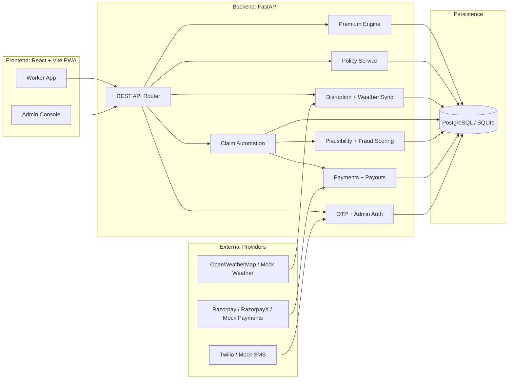
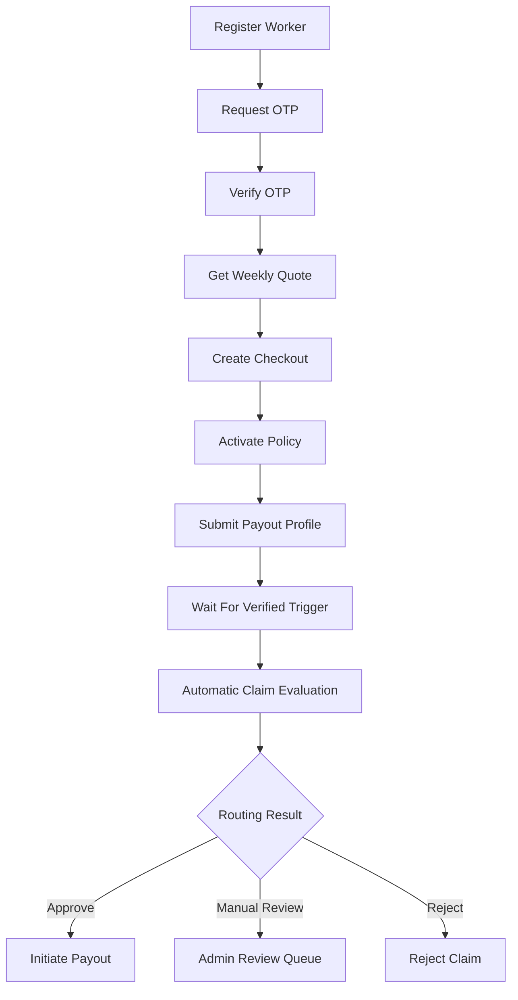
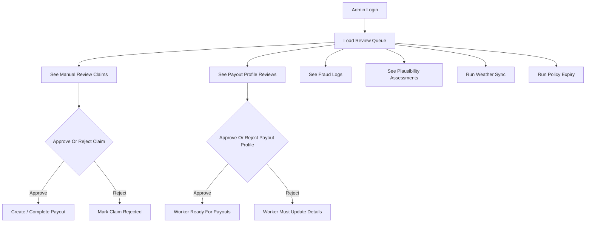
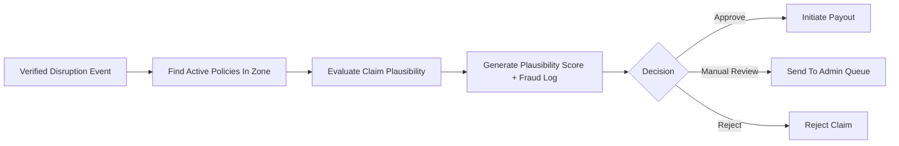
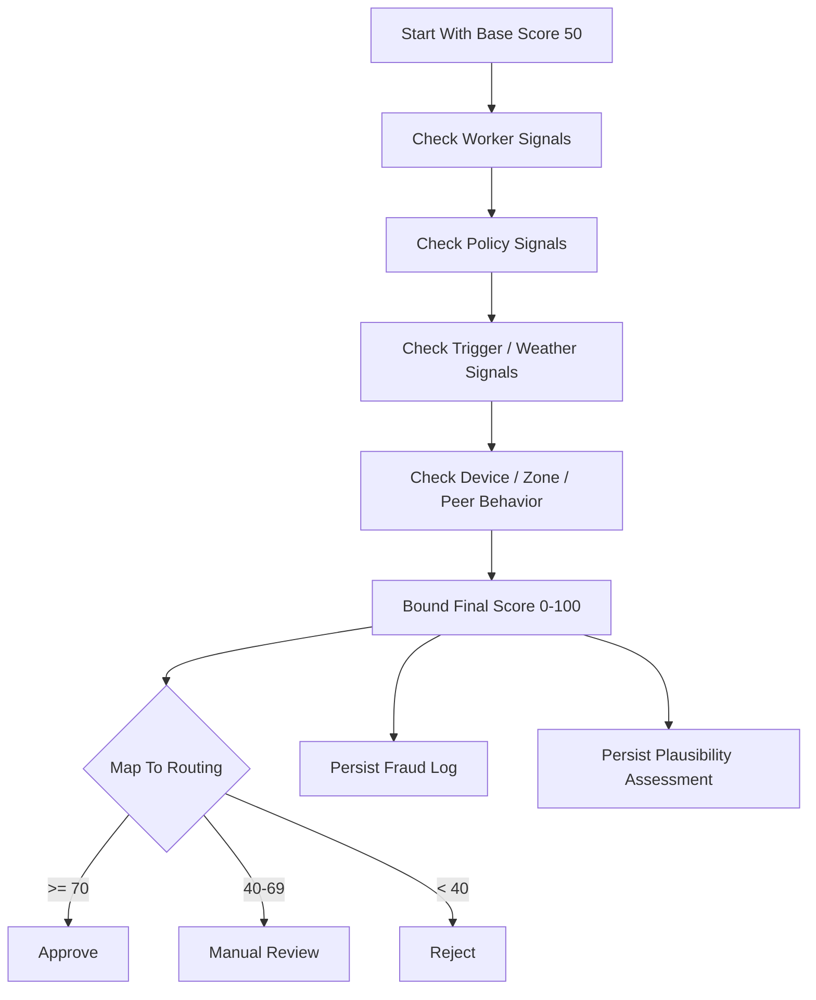

# GigShield 2.0

**Parametric micro-insurance for Indian gig workers**

GigShield is a full-stack insurance platform designed for delivery and gig workers whose income can disappear the moment weather, air quality, curfews, floods, or local disruption events make work impossible. Instead of relying on slow reimbursement-style claims, GigShield uses a **parametric model**: if a verified trigger occurs in a worker's zone, the system computes the payout path automatically.

Built for the **Guidewire DEVTrails 2026** hackathon, the project focuses on one clear problem: protecting weekly income for workers who live with high volatility and low financial buffer.

## Table Of Contents

- [Problem Statement](#problem-statement)
- [Why GigShield](#why-gigshield)
- [Solution Overview](#solution-overview)
- [Core Features](#core-features)
- [System Architecture](#system-architecture)
- [End-To-End Workflow](#end-to-end-workflow)
- [Special Logic Implemented](#special-logic-implemented)
- [Tech Stack](#tech-stack)
- [Project Structure](#project-structure)
- [Local Development](#local-development)
- [Deployment Notes](#deployment-notes)
- [Security Notes](#security-notes)
- [Current Status](#current-status)
- [License](#license)

## Problem Statement

Indian gig workers often earn on a daily or weekly basis. Their income is highly exposed to events outside their control:

- heavy rain and flooding
- extreme heat
- severe air quality events
- curfews and city shutdowns
- platform or zone-level disruption

Traditional insurance products are not built for this pattern. They are often:

- claim-heavy and document-heavy
- slow to process
- misaligned with short income cycles
- not designed for low-ticket weekly protection

The result is a major protection gap: workers bear real income risk, but the available financial safety nets are not designed for the way gig work actually functions.

## Why GigShield

GigShield is designed around the reality of gig work:

- **weekly cover instead of annual complexity**
- **parametric triggers instead of reimbursement paperwork**
- **mobile-first worker experience**
- **admin review only when a claim looks risky or ambiguous**
- **mock-friendly integrations for demo mode, with clean paths to live providers**

The product is intentionally focused on **income protection**, not health, accident, or repair insurance. That keeps the model explainable, fast, and aligned with the original problem.

## Solution Overview

GigShield combines:

- worker onboarding and OTP login
- dynamic weekly premium quoting
- policy purchase with mock or live payment flow
- disruption ingestion from mock feeds or OpenWeatherMap
- automatic claim generation for eligible active policies
- explainable fraud and plausibility scoring
- claim routing to auto-approve, manual review, or reject
- payout profile onboarding and admin review
- mock or live payout handling

In short: the worker buys a weekly policy, a disruption is detected, the platform evaluates eligibility and plausibility, and the claim is either paid automatically or surfaced to admin review with a transparent explanation trail.

## Core Features

- **Weekly parametric cover** for predefined disruption triggers.
- **Dynamic quote engine** based on city, platform, earnings, tenure, and trust score.
- **Trust-based underwriting** that rewards stable, verified worker behavior.
- **Explainable claim scoring** with explicit positive and negative signals.
- **Admin operations console** for claim review, payout review, weather sync, and maintenance actions.
- **PWA frontend** optimized for mobile-first usage.
- **Mock/live integration switches** for SMS, weather, policy payment, and claim payouts.

## System Architecture

### High-Level Architecture



### Backend Service Map

- `backend/app/services/premium.py`: weekly premium and risk multiplier computation
- `backend/app/services/policies.py`: quote-to-policy activation flow
- `backend/app/services/providers.py`: SMS and weather provider abstraction
- `backend/app/services/weather_sync.py`: disruption event generation from provider signals
- `backend/app/services/claims.py`: automatic claim creation and payout initiation
- `backend/app/services/plausibility.py`: explainable plausibility and fraud-risk scoring
- `backend/app/services/trust.py`: worker trust score calculation and recomputation
- `backend/app/services/payments.py`: policy checkout, payment verification, payout execution
- `backend/app/services/admin.py`: admin review and operations flows

### API Surface

The primary API domains exposed through `backend/app/api/v1/router.py` are:

- `/auth`
- `/premium`
- `/workers`
- `/policies`
- `/disruptions`
- `/claims`
- `/admin`
- `/internal`
- `/payments`

## End-To-End Workflow

### Worker Journey



### Admin Operations Workflow



### Parametric Claim Flow



## Special Logic Implemented

This project is more than CRUD and screens. The main custom logic lies in pricing, trust computation, parametric payout sizing, and claim plausibility scoring.

### 1. Dynamic Weekly Premium Algorithm

Implemented in `backend/app/services/premium.py`.

Inputs:

- city risk index
- platform factor
- average weekly earnings
- tenure days
- trust score
- selected coverage tier

How it works:

1. Compute a bounded `risk_score` from city, earnings, tenure, trust, and platform.
2. Convert that to a `risk_multiplier`.
3. Multiply against tier-specific base premium.
4. Bound the final premium to a weekly range.

This produces a quote that is:

- short-cycle
- explainable
- consistent across workers in similar conditions

### 2. Trust Score Logic

Implemented in `backend/app/services/trust.py`.

The trust score begins with:

- base score
- KYC bonus
- tenure bonus

It is then recomputed over time using:

- number of policies purchased
- approved claims
- manual-review history
- rejected claims
- confirmed fraud signals
- recent adverse behavior

Purpose:

- influence underwriting
- influence claim scrutiny
- reward stable worker behavior

### 3. Parametric Claim Amount Logic

Implemented in `backend/app/services/claims.py`.

Once a disruption event is verified, GigShield does not wait for receipts or manual loss estimation. Instead:

1. find all active policies in the affected zone
2. compute payout amount from policy coverage and disruption severity
3. evaluate plausibility
4. route the claim

The severity multiplier currently maps as:

- severity `1` → `25%` of coverage
- severity `2` → `50%` of coverage
- severity `3` → `75%` of coverage
- severity `4` → `100%` of coverage

That is the core of the parametric design.

### 4. Explainable Claim Plausibility And Fraud-Risk Scoring

Implemented in `backend/app/services/plausibility.py`.

This is the main custom decision engine in the system.

#### Scoring Model

Each claim starts with a base score of `50`.

The engine then adds or subtracts weighted signals such as:

- duplicate claim detection
- worker trust score
- policy age
- worker tenure
- zone history match or mismatch
- device fingerprint reuse across workers
- claim amount vs purchased coverage
- verified trigger consistency
- weather payload consistency
- peer claim density in the same event window
- rejection or fraud history

The final score is bounded to `0-100`.

#### Routing Logic

- score `>= 70` → `approve`
- score `40-69` → `manual_review`
- score `< 40` → `reject`

This is valuable because it is **explainable**. Every score is stored with the exact supporting signals, which are then shown to the admin in the UI.

#### Plausibility Workflow



### 5. Mock / Live Provider Switching

Implemented mainly in `backend/app/services/providers.py` and `backend/app/services/payments.py`.

The project supports clean environment-based switching between:

- mock SMS and Twilio
- mock weather and OpenWeatherMap
- mock policy payment and Razorpay Checkout
- mock payout and RazorpayX payout flow

This makes the project practical for both:

- hackathon demos
- later production-oriented extension

## Tech Stack

- **Backend**: Python, FastAPI, SQLAlchemy, Alembic, Pydantic
- **Frontend**: React 18, TypeScript, Vite, PWA assets, Vanilla CSS
- **Database**: PostgreSQL-oriented schema with SQLite fallback for local runs and tests
- **Payments**: Razorpay / RazorpayX with mock-mode support
- **Messaging**: Twilio with mock-mode support
- **Weather**: OpenWeatherMap with mock-mode support
- **Testing**: Pytest
- **Infra**: Docker, Nginx, Render, Vercel
- **Documentation**: Mermaid diagrams

## Project Structure

```text
.
├── backend/
│   ├── app/
│   │   ├── api/                # FastAPI routes
│   │   ├── core/               # config, security, shared runtime logic
│   │   ├── db/                 # engine and session wiring
│   │   ├── models/             # SQLAlchemy models
│   │   ├── repositories/       # data access layer
│   │   ├── schemas/            # request/response contracts
│   │   └── services/           # pricing, claims, plausibility, payouts, auth
│   ├── alembic/                # migrations
│   └── tests/                  # backend test suite
├── frontend/
│   ├── src/
│   │   ├── components/         # worker/admin/auth UI
│   │   └── lib/                # API client, constants, formatting, state
│   └── vercel.json             # Vercel config for SPA deploy
├── infra/                      # Docker and Nginx configuration
├── docs/                       # notes and presentation support
├── render.yaml                 # Render backend deployment config
└── .env.template               # environment template
```

## Local Development

### Prerequisites

- Python `3.10+`
- Node.js `18+`
- npm

### 1. Install Backend

```bash
cd backend
python3 -m venv .venv
source .venv/bin/activate
pip install -e .
alembic upgrade head
```

### 2. Install Frontend

```bash
cd frontend
npm install
```

### 3. Run Full Stack Locally

From the repo root:

```bash
npm install
npm run dev:full
```

This starts:

- backend on `http://127.0.0.1:8000`
- frontend on `http://localhost:3000`

### 4. Alternative: Docker

```bash
docker-compose up --build
```

## Deployment Notes

### Current Deployment Shape

- **Frontend**: Vercel
- **Backend**: Render

### Render Backend

Files added for deployment:

- `render.yaml`
- `backend/render-start.sh`

Expected backend env vars:

- `SECRET_KEY`
- `ADMIN_API_KEY`
- `DATABASE_URL`
- `ALLOWED_ORIGINS`
- `ALLOWED_HOSTS`
- `USE_MOCK_SMS`
- `USE_MOCK_WEATHER`
- `USE_MOCK_PAYOUTS`

### Vercel Frontend

Frontend deployment config:

- `frontend/vercel.json`

Expected frontend env var:

- `VITE_API_BASE_URL`

## Security Notes

This repo is demo-ready and includes a number of real protections:

- OTP request throttling
- OTP verify attempt limits
- admin bearer-token authentication
- trusted-host enforcement
- API security headers
- frontend CSP and referrer policy
- payout profile review before live payout flow

Important practical note:

- the current setup is suitable for **hackathon / judge demo mode**
- production hardening would still require stronger session handling, more restrictive CSP, stricter secret handling, and a deeper infra security pass

## Current Status

Implemented and working:

- worker registration and OTP login
- premium quote generation
- policy purchase flow
- disruption ingestion and weather sync
- automatic claim creation
- fraud log generation
- plausibility scoring and admin review routing
- payout profile onboarding and admin review
- mock/live integration switching
- admin operations console

Demo caveats:

- live weather only creates disruptions when thresholds are actually met
- mock weather remains the best option when you need guaranteed demo events on demand
- mock payouts remain the safest mode for judge demos unless live Razorpay flows are explicitly required

## License

Distributed under the MIT License.

---

**GigShield 2.0** is a worker-first, explainable, parametric protection platform for the reality of Indian gig work: volatile conditions, weekly income dependence, and the need for fast, trusted decisions.
